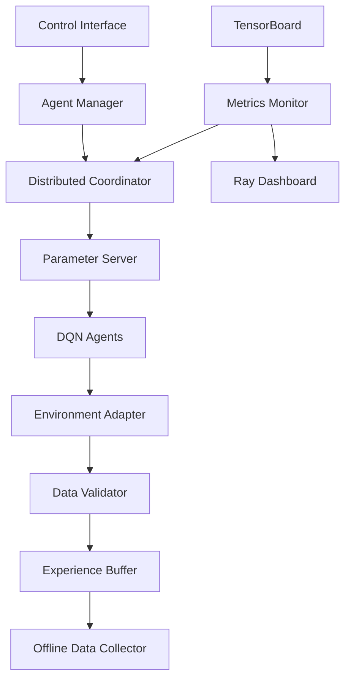
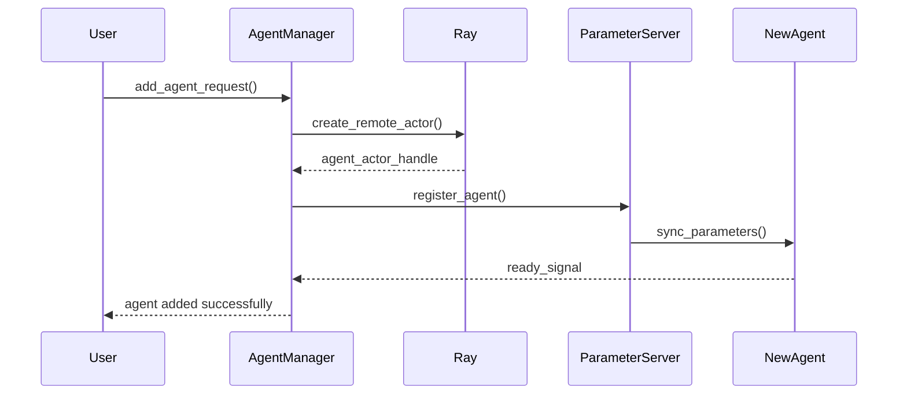
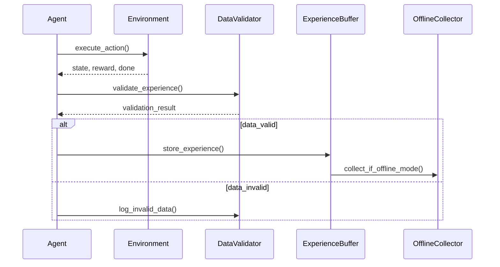
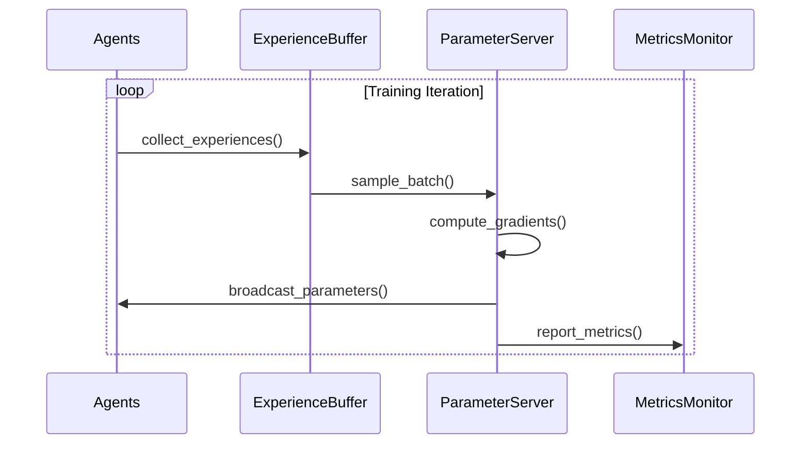
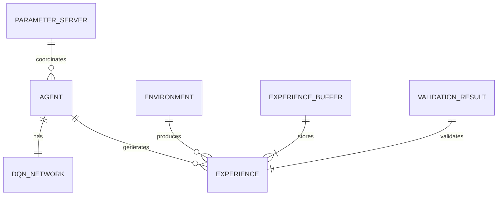
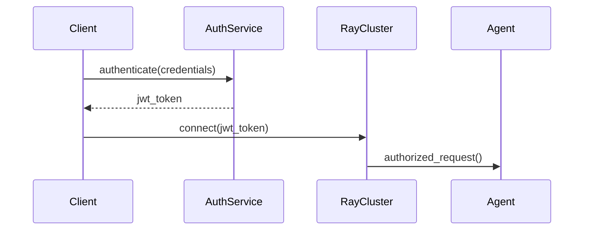
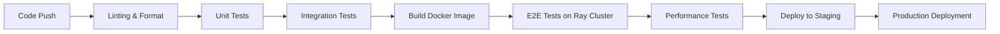

# 技術設計

## 概要
適応型マルチエージェント分散強化学習システムは、Rayフレームワークを基盤とした環境非依存のスケーラブルな学習プラットフォームです。動的エージェント管理、学習データ品質検証、オフライン学習データ蓄積機能を統合し、Parameter Server パターンとActor-Learner分散アーキテクチャにより効率的な分散学習を実現します。

## 要件マッピング

### 設計コンポーネントトレーサビリティ
各設計コンポーネントは特定の要件に対応します：
- **AgentManager** → REQ-1: 動的エージェント管理システム
- **EnvironmentAdapter** → REQ-2: 環境非依存インターフェース  
- **DataValidator** → REQ-3: 学習データ検証システム
- **OfflineDataCollector** → REQ-4: オフライン学習データ蓄積機能
- **DistributedCoordinator** → REQ-5: 分散学習協調システム
- **MetricsMonitor** → REQ-6: 性能監視・診断システム

### ユーザーストーリーカバレッジ
要件書のすべてのユーザーストーリーに対応：
- システム管理者: AgentManagerによる動的スケーリング機能
- 研究者: EnvironmentAdapterによる環境非依存実験環境
- データサイエンティスト: DataValidatorによる自動データ品質検証
- 機械学習エンジニア: OfflineDataCollectorによるオフライン学習支援
- システムアーキテクト: DistributedCoordinatorによる大規模分散学習
- 運用エンジニア: MetricsMonitorによるリアルタイム監視

## アーキテクチャ

### 高次システムアーキテクチャ



### 技術スタック
研究結果と要件分析に基づく技術選択：

- **分散フレームワーク**: Ray 2.0+ (Parameter Server、Actor remoting)
- **深層学習**: PyTorch (DQN実装、GPU最適化)
- **環境インターフェース**: Gymnasium + PettingZoo (標準化されたRL環境)
- **データ処理**: NumPy + Pandas (数値計算、データ前処理)
- **設定管理**: Hydra + YAML (階層的設定管理)
- **監視**: Ray Dashboard + TensorBoard (分散実行監視、学習可視化)
- **テスト**: pytest + Ray Test Utils (分散環境テスト)
- **シリアライゼーション**: Ray Object Store (ゼロコピー共有メモリ)

### アーキテクチャ決定根拠
研究に基づく主要技術選択の理由：

- **Ray Framework採用理由**: 2024年研究で証明された階層的スケジューリング、ネイティブMARL支援、統合されたタスク並列・アクター抽象化
- **Parameter Server パターン**: 分散RLのベストプラクティス、非同期学習と同期学習の柔軟な切り替え対応
- **PyTorch選択**: 動的グラフ、研究コミュニティでの支配的地位、Rayとのネイティブ統合
- **Experience Replay分散化**: 2024年研究による優先度付きサンプリングの安定性向上、メモリ効率性の実証

## データフロー

### 主要ユーザーフロー
上位3つのユーザーフローのシーケンス図：

#### 1. 動的エージェント追加フロー


#### 2. 学習データ検証・蓄積フロー


#### 3. 分散学習協調フロー


## コンポーネントとインターフェース

### バックエンドサービス・メソッドシグネチャ

```python
class AgentManager:
    def add_agent(self, agent_config: AgentConfig) -> str:  # エージェント追加、IDを返す
    def remove_agent(self, agent_id: str) -> bool:         # エージェント安全削除
    def scale_agents(self, target_count: int) -> List[str]: # 指定数にスケーリング
    def get_agent_status(self) -> Dict[str, AgentStatus]:   # 全エージェント状態取得

class EnvironmentAdapter:
    def register_environment(self, env_spec: EnvSpec) -> bool:     # 環境登録
    def create_environment(self, env_name: str) -> Environment:    # 環境インスタンス作成
    def normalize_observation(self, obs: Any) -> np.ndarray:       # 観測値正規化
    def normalize_action_space(self, action_space: Any) -> ActionSpace: # 行動空間正規化

class DataValidator:
    def validate_experience(self, experience: Experience) -> ValidationResult: # 経験データ検証
    def detect_outliers(self, data: np.ndarray) -> List[int]:                # 異常値検出
    def check_consistency(self, multi_agent_data: Dict) -> ConsistencyReport: # 整合性チェック
    def apply_constraints(self, state_sequence: List) -> bool:                # 物理制約チェック

class DistributedCoordinator:
    def initialize_cluster(self, cluster_config: ClusterConfig) -> bool:      # クラスタ初期化
    def coordinate_learning(self, agents: List[Agent]) -> None:               # 学習協調
    def handle_worker_failure(self, failed_worker_id: str) -> bool:           # 障害処理
    def balance_workload(self, current_load: Dict) -> RebalanceAction:        # 負荷分散

class OfflineDataCollector:
    def enable_offline_mode(self, config: OfflineConfig) -> bool:             # オフラインモード有効化
    def collect_external_actions(self, action_source: ActionSource) -> int:   # 外部アクション収集
    def generate_statistics(self, data_range: TimeRange) -> StatisticsReport: # 統計レポート生成
    def archive_old_data(self, retention_policy: RetentionPolicy) -> int:     # 古いデータアーカイブ
```

### APIエンドポイント

| Method | Route | Purpose | Auth | Status Codes |
|--------|-------|---------|------|--------------|
| POST   | /api/agents | エージェント追加 | Required | 201, 400, 401, 500 |
| DELETE | /api/agents/:id | エージェント削除 | Required | 204, 401, 404, 500 |
| GET    | /api/agents/status | エージェント状態取得 | Required | 200, 401, 500 |
| POST   | /api/environments | 環境登録 | Required | 201, 400, 401, 500 |
| GET    | /api/metrics | 性能メトリクス取得 | Required | 200, 401, 500 |
| POST   | /api/offline/enable | オフラインモード有効化 | Required | 200, 400, 401, 500 |
| GET    | /api/validation/report | データ検証レポート | Required | 200, 401, 500 |

## データモデル

### ドメインエンティティ
1. **Agent**: 個別の学習エージェント（DQNネットワーク、状態、設定）
2. **Environment**: 学習環境（Gym/PettingZoo ラッパー、状態空間、行動空間）
3. **Experience**: 学習経験（状態、行動、報酬、次状態、終了フラグ）
4. **ExperienceBuffer**: 経験リプレイバッファ（優先度付きサンプリング対応）
5. **ValidationResult**: データ検証結果（妥当性、異常値、品質スコア）

### エンティティ関係図


### データモデル定義

```python
@dataclass
class Agent:
    id: str
    network: DQNNetwork
    target_network: DQNNetwork
    optimizer: torch.optim.Optimizer
    config: AgentConfig
    status: AgentStatus
    created_at: datetime
    last_updated: datetime

@dataclass 
class Experience:
    state: np.ndarray
    action: int
    reward: float  
    next_state: np.ndarray
    done: bool
    agent_id: str
    timestamp: datetime
    priority: float = 1.0
    
@dataclass
class ValidationResult:
    is_valid: bool
    quality_score: float
    anomaly_flags: List[str]
    constraint_violations: List[str]
    validated_at: datetime

@dataclass
class EnvironmentSpec:
    name: str
    observation_space: Any
    action_space: Any
    max_episode_steps: int
    wrapper_config: Dict[str, Any]
    registered_at: datetime
```

### データベーススキーマ
Ray Object Store + SQLite による永続化：

```sql
-- エージェント管理テーブル
CREATE TABLE agents (
    id TEXT PRIMARY KEY,
    config JSON,
    status TEXT,
    network_checkpoints TEXT,
    created_at TIMESTAMP,
    last_updated TIMESTAMP
);

-- 環境登録テーブル  
CREATE TABLE environments (
    name TEXT PRIMARY KEY,
    spec JSON,
    adapter_class TEXT,
    registered_at TIMESTAMP
);

-- 検証ログテーブル
CREATE TABLE validation_logs (
    id INTEGER PRIMARY KEY AUTOINCREMENT,
    experience_hash TEXT,
    validation_result JSON,
    validated_at TIMESTAMP
);
```

### マイグレーション戦略
- **バージョン管理**: Alembic による スキーマバージョン管理
- **後方互換性**: 古いExperience形式の自動変換
- **データ変換**: バッチ処理による大容量データ移行
- **インデックス戦略**: timestamp, agent_id にインデックス作成

## エラーハンドリング

### 階層的エラー処理戦略
1. **Ray Level**: ActorException, WorkerFailure の捕捉と再試行
2. **Component Level**: 各コンポーネント固有の例外定義と処理
3. **Application Level**: グローバルエラーハンドラによる統合的処理
4. **User Level**: 分かりやすいエラーメッセージと復旧提案

### カスタム例外階層
```python
class AdaptiveMAException(Exception):
    """基底例外クラス"""
    pass

class AgentManagementError(AdaptiveMAException):
    """エージェント管理関連エラー"""
    pass

class EnvironmentAdapterError(AdaptiveMAException):
    """環境アダプタ関連エラー"""
    pass

class DataValidationError(AdaptiveMAException):
    """データ検証関連エラー"""
    pass

class DistributedCoordinationError(AdaptiveMAException):
    """分散協調関連エラー"""
    pass
```

## セキュリティ考慮事項

### 認証・認可
Ray Clusterの認証機能活用：


### 認可マトリクス
| Role | Agent Management | Environment Config | Data Access | System Admin |
|------|------------------|-------------------|-------------|--------------|
| Administrator | Full | Full | Full | Full |
| Researcher | Read | Full | Read | None |
| Data Scientist | Read | Read | Full | None |
| Observer | Read | Read | Read | None |

### セッション管理戦略
- **JWT Token**: ステートレス認証、有効期限管理
- **Ray Security**: クラスタレベルの認証・暗号化
- **セッション永続化**: Redis による分散セッション管理

### データ保護
- **入力検証**: Pydantic による厳密なスキーマ検証
- **暗号化**: Ray TLS による通信暗号化、保存データのAES暗号化
- **機密データ処理**: 環境変数による認証情報管理、ログからの機密情報除外

### セキュリティベストプラクティス
- **OWASP対策**: 入力検証、SQLインジェクション防止、XSS対策
- **API Rate Limiting**: Ray Actor レベルでのリクエスト制限
- **CORS設定**: 開発・本番環境での適切なオリジン制限
- **セキュリティヘッダ**: HSTS, CSP, X-Frame-Options の実装

## パフォーマンス・スケーラビリティ

### パフォーマンス目標
| メトリクス | 目標値 | 測定方法 |
|------------|--------|-----------|
| エージェント追加時間(p95) | < 2秒 | Agent Management API |
| Experience処理時間(p99) | < 10ms | Data Pipeline監視 |
| 学習更新頻度 | > 100 updates/sec | Parameter Server監視 |
| データベースクエリ(p99) | < 50ms | SQLiteクエリ監視 |
| 同時エージェント数 | > 1000 agents | システム容量テスト |

### キャッシュ戦略
- **Ray Object Store**: Experience Buffer の共有メモリキャッシュ
- **Parameter Cache**: 頻繁にアクセスされるモデルパラメータ
- **Environment Cache**: 環境インスタンス の再利用プール
- **Validation Cache**: 繰り返し検証結果のメモ化

### スケーラビリティアプローチ
- **水平スケーリング**: Ray Cluster の動的ノード追加
- **垂直スケーリング**: GPU メモリとバッチサイズ最適化
- **非同期処理**: Ray remote function による並列Experience処理
- **自動スケーリング**: Cluster Autoscaler による負荷ベース調整

## テスト戦略

### テストカバレッジ要件
- **ユニットテスト**: ≥85% コードカバレッジ
- **統合テスト**: 全API エンドポイントと Ray アクター連携
- **E2Eテスト**: クリティカルな学習パイプライン
- **パフォーマンステスト**: 予想ピーク負荷の2倍での負荷テスト

### テストアプローチ
1. **ユニットテスト**
   - 個別コンポーネント機能の独立テスト
   - Ray Remote の モック化
   - ビジネスロジックの重点テスト

2. **統合テスト**
   - Ray Cluster での分散コンポーネント連携テスト
   - Environment Adapter の実環境テスト
   - Experience Buffer の並行アクセステスト

3. **End-to-Endテスト**
   - エージェント追加から学習完了までの完全フロー
   - データ検証パイプラインの統合テスト
   - 障害回復シナリオテスト

4. **パフォーマンステスト**
   - Ray Test Utils を使用した負荷テスト
   - 大量エージェントでのストレステスト
   - メモリリーク検証のための長時間テスト

### CI/CDパイプライン


### テスト環境構成
- **Local**: pytest + Ray local cluster (開発者環境)
- **CI**: GitHub Actions + Ray cluster simulation 
- **Staging**: 本番相当の Ray Cluster 環境
- **Performance**: 専用GPU cluster での負荷テスト環境